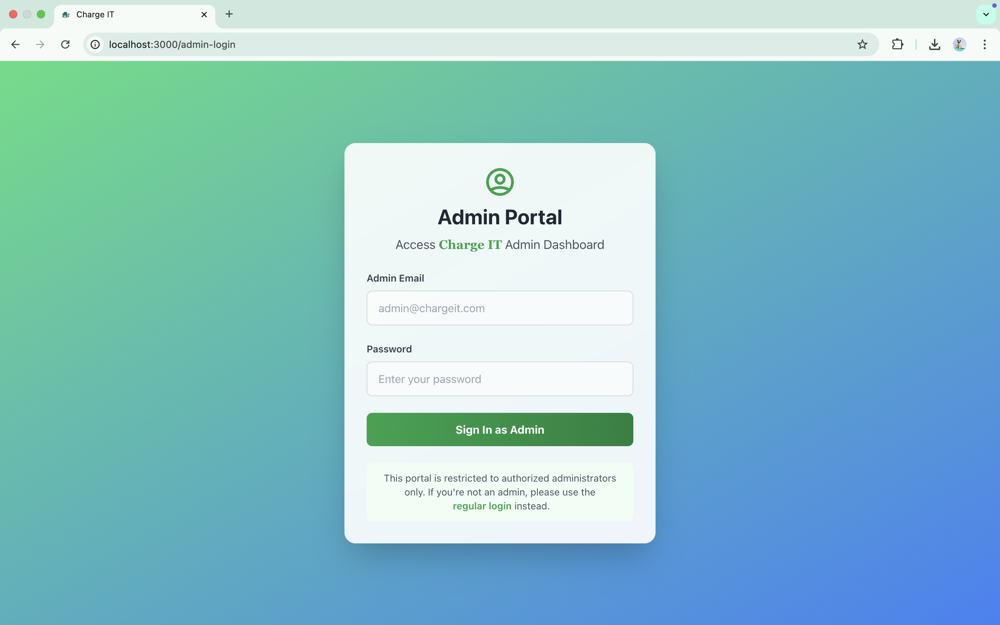
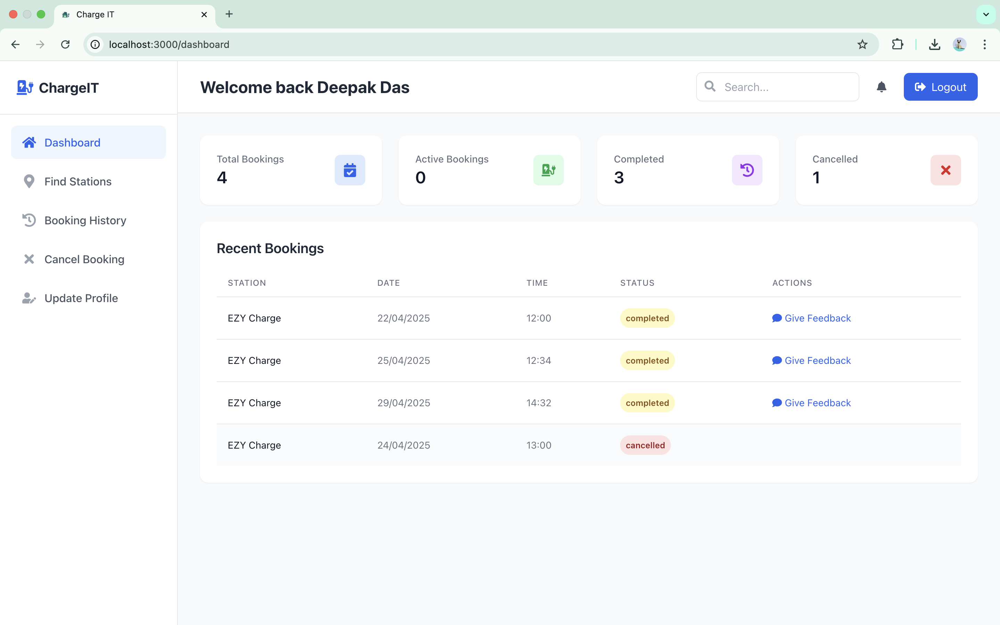
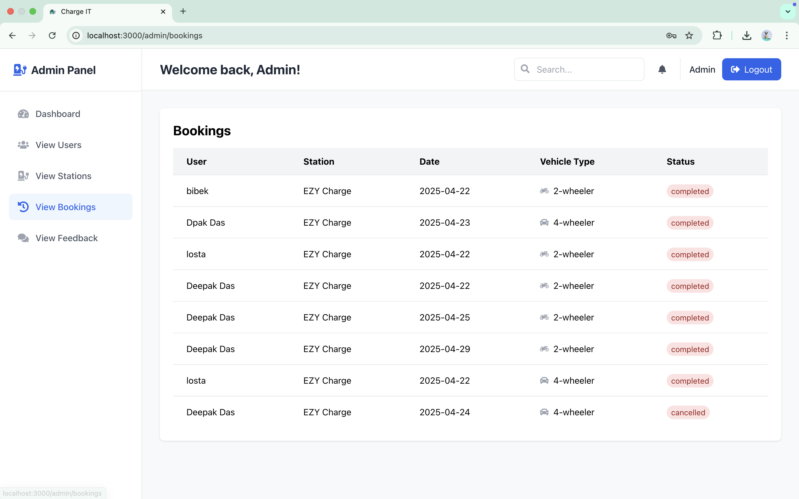

# ChargeIT - Electric Vehicle Charging Management System

ChargeIT is a modern web application for managing electric vehicle charging stations. It provides features for both users and administrators to monitor and manage charging sessions.






## Features

- User authentication with email/password and Google Sign-in
- Separate dashboards for users and administrators
- Real-time charging station monitoring
- Session management and history
- Responsive design with modern UI

## Prerequisites

Before running this project, make sure you have the following installed:
- Node.js (v14 or higher)
- npm (v6 or higher)
- Git

## Setup Instructions

1. Clone the repository:
```bash
git clone https://github.com/dpakdas10/EV-Charging-Station-Finding-Web-App.git
cd EV-Charging-Station-Finding-Web-App
```

2. Install dependencies:
```bash
npm install
```

3. Create a Firebase project:
   - Go to [Firebase Console](https://console.firebase.google.com/)
   - Click "Add project" and follow the setup wizard
   - Enable Authentication (Email/Password and Google Sign-in)
   - Create a Firestore database

4. Configure Firebase:
   - In your Firebase project settings, find your configuration object
   - Create a `.env` file in the root directory with the following variables:
   ```
   REACT_APP_FIREBASE_API_KEY=your_api_key
   REACT_APP_FIREBASE_AUTH_DOMAIN=your_auth_domain
   REACT_APP_FIREBASE_PROJECT_ID=your_project_id
   REACT_APP_FIREBASE_STORAGE_BUCKET=your_storage_bucket
   REACT_APP_FIREBASE_MESSAGING_SENDER_ID=your_messaging_sender_id
   REACT_APP_FIREBASE_APP_ID=your_app_id
   ```

5. Run the development server:
```bash
npm start
```

The application will be available at `http://localhost:3000`

## Firebase Database Structure

### Collections

1. `users`
   - Document ID: User UID
   - Fields:
     - `email`: string
     - `role`: string ('user' or 'admin')
     - `createdAt`: timestamp

2. `charging_sessions`
   - Document ID: Auto-generated
   - Fields:
     - `userId`: string (reference to users collection)
     - `stationId`: string
     - `startTime`: timestamp
     - `endTime`: timestamp
     - `status`: string ('active', 'completed', 'cancelled')
     - `energyConsumed`: number
     - `cost`: number

3. `stations`
   - Document ID: Auto-generated
   - Fields:
     - `name`: string
     - `location`: string
     - `status`: string ('available', 'in-use', 'maintenance')
     - `powerRating`: number
     - `connectorType`: string

## Security Rules

```javascript
rules_version = '2';
service cloud.firestore {
  match /databases/{database}/documents {
    match /users/{userId} {
      allow read: if request.auth != null && request.auth.uid == userId;
      allow write: if request.auth != null && request.auth.uid == userId;
    }
    
    match /charging_sessions/{sessionId} {
      allow read: if request.auth != null;
      allow create: if request.auth != null;
      allow update, delete: if request.auth != null && 
        (resource.data.userId == request.auth.uid || 
         get(/databases/$(database)/documents/users/$(request.auth.uid)).data.role == 'admin');
    }
    
    match /stations/{stationId} {
      allow read: if request.auth != null;
      allow write: if request.auth != null && 
        get(/databases/$(database)/documents/users/$(request.auth.uid)).data.role == 'admin';
    }
  }
}
```

## Contributing

1. Fork the repository
2. Create your feature branch (`git checkout -b feature/AmazingFeature`)
3. Commit your changes (`git commit -m 'Add some AmazingFeature'`)
4. Push to the branch (`git push origin feature/AmazingFeature`)
5. Open a Pull Request

## License

This project is licensed under the MIT License - see the [LICENSE](LICENSE) file for details.

## Contact

Deepak Das - dpakdas10@gmail.com
Project Link: [https://github.com/dpakdas10/EV-Charging-Station-Finding-Web-App](https://github.com/dpakdas10/EV-Charging-Station-Finding-Web-App)
